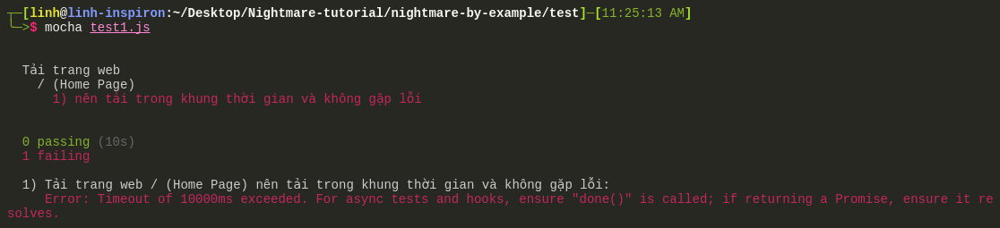

# Nightmarejs
* Nightmare là một thư viện tự động hóa chạy browser. Nightmare sử dụng electron để truy cập web, mỗi lần truy xuất vào 1 url và lấy dữ liệu trên trang này, sẽ dùng mở bằng electron, hoàn thành tác vụ thì ngắt và đóng electron  
* Nightmare bắt chước các tương tác của người dùng trên 1 trang web như:
  * Truy xuất: `goto`
  * Đánh chữ: `type` 
  * Nhấn chuột: `click`
* Thường được sử dụng cho kiểm thử UI hoặc cào dữ liệu

## Cài đặt: 
* Nightmare là module của Nodejs nên máy các bạn cần cài đặt Nodejs

* Cài đặt Nightmarejs với npm
```bash
$ npm install --save nightmare
```
* Các file nightmare chúng ta sẽ viết là javascript nên ví dụ để chạy 1 file cào dữ liệu từ vnexpress, tên file là vnexpress.js
```bash
$ node vnexpress.js
```

## VÍ DỤ LẤY TIÊU ĐỀ CÁC BÀI BÁO TRÊN TRANG CHỦ VNEXPRESS
#### CÁC BƯỚC: 
* Cài đặt nodejs
* Cài đặt nightmarejs
```bash
$ npm install nightmare
```
* Gọi module và khởi tạo nightmare
```js
// Gọi module Nightmare để sử dụng
const Nightmare = require('nightmare');
// khởi tạo nightmare
const nightmare = Nightmare();
```

* `goto(url)`: truy xuất 1 trang web theo địa chị url truyền vào
  * Có thể đặt thời gian thoát - ném ra lỗi trong qua trình chạy chương trình (throw an exception - exception là lỗi xảy ra trong runtime) nếu `goto()` không hoàn thành loading trong khoảng thời gian nhất định với `gotoTimeout`. Lưu ý, chỉ ném lỗi khi hết thời gian mà DOM chưa đc tải (chứ không phải là tất cả các resources trên trang web)
```js
  // thêm option lúc khởi tạo nightmare
  const nightmare = Nightmare({
    gotoTimeout: 1000 // tính theo ms -> 1000ms là 1s
  })
```
  * `{show: true}` option để hiển thị electron web khi chạy chương trình nightmare
```js
  // thêm option lúc khởi tạo nightmare
  const nightmare = Nightmare({
    gotoTimeout: 1000,
    show: true // hiển thị web khi chạy, nếu không có option này thì chạy ẩn
  })
  // sau khi khởi tạo -> truy xuất vào trang vnexpress.net
  nightmare.goto('http://vnexpress.net/') 
```

* `evaluate(function(){...})` dùng để lấy thông tin từ 1 website. Thực hiện hàm bên trong evaluate() trên trang web đang truy cập để lấy thông tin sau đó trả về dữ liệu đc return từ hàm đó

```js
  nightmare.goto('http://vnexpress.net/')
  .evaluate(function () {
    // news là 1 mảng chứa các thẻ <a> nằm trong <div> có class 'title_news'
    let news = document.querySelectorAll('.title_news a');
    // khai báo 1 mảng rỗng để chứa các tiêu đề
    let titles = [];
    // chạy qua mảng này và lấy tiêu đề
    news.forEach((article) => { // article ở đây là mỗi phần tử trong mảng news
      titles.push(article.innerText.trim()); // lần lượt đẩy các tiêu đề vào mảng titles
    })
    return titles; // kết thúc hàm trả về mảng titles
  })
```

* **Lưu ý**: 
  * `document.querySelectorAll('.title_news a')` sẽ tìm tất cả các `<a>` là con của thẻ có class `.title_news`
  * `trim()` cắt các khoảng trống trắng trước và sau 1 chuỗi

  ```js
  let title = '\n     Đây là 1 tiêu đề    ';
  console.log(title);
  let trimmedTitle = title.trim()
  console.log(trimmedTitle); // 'Đây là 1 tiêu đề'
  ```

* `end()` kết thúc 1 quy trình trên 1 website, ngắt kết nối và đống cửa sổ electron
* Nếu sử dụng promise `then()` phải đc gọi sau khi `end()`. Trong `then()`, ta có thể hứng kết quả trả về từ đoạn lấy dữ liệu trang web trong `evaluate()`

```js
  .end() // kết thúc quy trình trên electron -> đóng electron
  .then(function (titles) { // titles trong then() này chính là kết quả titles đc trả về ở trên
    console.log(titles);
    console.log('Số lượng bài viết: ', titles.length);
  })
  .catch(error => { // xử lý trong trường hợp gặp lỗi 
    console.log('ERROR: ', error);
  })
```

## VÍ DỤ TỰ ĐỘNG ĐĂNG NHẬP VÀO FACEBOOK
* `type(selector, text)` sẽ tự động điền chuỗi `text` vào `selector`. Nếu `text` trống thì sẽ xóa giá trị trong `selector`
* Có thể gọi sự kiện keypress với `type` sử dụng unicode thay cho keypress, ví dụ, muốn thực hiện sự kiện nhấn phím 'enter' `.type('body', '\u000d')` (ở đây, selector chính là thẻ <body>, '\u000d' sẽ thay cho nút 'enter')

* `insert(selector, text)` tương tự như `type` nhưng không có chức nặng gọi sự kiện liên quan đến keyboard => nếu chỉ điền chữ thì dùng `insert` sẽ nhanh hơn 

```bash
$ node fb.js // đăng nhập fb sử dụng type() và click()

$ node fb2.js // sử dụng insert() và type()
```

## VÍ DỤ scrollTo TRÊN KENH14.VN 

## VÍ DỤ LẤY, XÓA COOKIES TRÊN YOUTUBE

## UI TESTING VỚI NIGHTMAREJS
* Sử dụng Nightmare để kiểm thử UI - UI Testing. Nightmare mô phỏng lại các hành vi của người dùng như vào 1 trang web, điền ô đăng nhập hay tìm kiếm, click vào các nút hay đường links
* Dưới đây sẽ hướng dẫn sử dụng Nightmarejs và Mocha để đánh giá UI của 1 trang web
* [Mocha](https://mochajs.org/ "Mocha"): là 1 test framework phổ biến cho Nodejs, tham khảo thêm tại đường dẫn
* Mocha là 1 testing framework cho phép dựng nên các test case, sẽ đc dùng với 1 thư viện assertion để kiểm tra kết quả trả về của test case và kết quả chúng ta mong đợi
* Trong những ví dụ dưới đây, tôi sẽ sử dụng module 'assert' có sẵn của Nodejs. Ngoài ra, các bạn có thể tham khảo và sử dụng các thư viện khác như chai, expect.js, should.js,....

### Để chạy các file test này

```bash
npm test // chạy tất cả các file test trong folder test
// chạy từng file test
cd test // mở terminal trong folder test
mocha test1.js // chạy test1.js
```

### Ví dụ 1: kiểm thử 1 trang web đang đc phát triển, sẽ chạy trên localhost

* Tạo test/test.js

```bash
mkdir test
// cài mocha và nightmare khi chỉ dùng để test
npm install --save-dev mocha
npm install --save-dev nightmare
```

* Viết các file test trong folder test/

#### Kiểm tra tốc độ tải 1 trang web
```bash
cd test
touch test1.js
```

* Gọi các modules cần sử dụng

```js
const Nightmare = require('nightmare')
const assert = require('assert') // 1 assertion library có sẵn trong Nodejs
```
* Khai báo 1 bộ test

```js
describe('Tải trang web',  function () {
  // viết các bộ test nhỏ hay các test case trong này
  //..........
})
```

* Sử dụng hàm `timeout()` của Mocha. Chi tiết về hàm này cách giá trị 'this' đc gán trong Mocha xem ví dụ trong file 
`test2.js`
**Sẽ sử dụng hoàn toàn hàm vô danh (anonymous function) thay vì arrow function**

```js
describe('Tải trang web',  function () {
  // Gợi ý: đặt timeout khi trang web chạy trên local 5s, trên remote web server 10s
  this.timeout('10s')
})
```

* Khởi tạo Nightmare để sử dụng trong bộ test

```js
describe('Tải trang web',  function () {
  // Gợi ý: đặt timeout khi trang web chạy trên local 5s, trên remote web server 10s
  this.timeout('10s')

  // khai báo biến nightmare và gán giá trị null - 1 giá trị rỗng
  // làm 1 biến để ta khởi tạo nightmare
  let nightmare = null;
  // vì mỗi bộ test con bên trong lại cần sử dụng 1 tiến trình nightmare riêng
  // beforeEach() chính là 1 hook trong Mocha -> đc gọi trc khi chạy mỗi bộ test con
  beforeEach(function () {
    nightmare = new Nightmare({show: true}) // khởi tạo 1 nightmare riêng cho từng bộ test con
  })
})
```

* Khai báo 1 bộ test con: test con tải trang chủ
* Test case 'tải trang chủ': truy xuất vào 'https://vnexpress.net' -> tải xong trang chủ -> kết thúc tiến trình electron -> gọi hàm callback done() -> báo lại với Mocha là test case hoàn thành -> in kết quả trên terminal

```js
  describe('/ (Trang chủ)', function () {
    // mỗi it() là 1 test case
    it('nên tải trong khung thời gian và không gặp lỗi', function(done) {
      // nếu muốn kiểm tra 1 trang local  `http://localhost:port/path`
      nightmare.goto('https://vnexpress.net')
        .end()
        .then(function (result) {
          done()
        })
        .catch(done)
    })
  })
```

* Kết quả chạy `test1.js`


* Nếu ta thay 'vnexpress.net' bằng 1 trang web bị chặn như 'bbc.com', thì trang sẽ k load đc và quá 10s sẽ báo lỗi: 'Error: Timeout of 10000ms exceeded.' quá thời gian 10s -> timeout dừng test



* Tương tự với test tải trang chủ, ta có thể test tải các đg dẫn khác trong 1 trang web, ví dụ, trang sản phẩm, trang tin tức, trang đăng nhập,... Ví dụ với test vnexpress ở trên, thêm 1 test kiểm tra trang giải trí

```js
  describe('Trang tin giải trí', function () {
    it('nên tải trang tin tức ok', function (done) {
      nightmare
        .goto('http://giaitri.vnexpress.net/')
        .end()
        .then(function () {
          done()
        })
        .catch(done)
    })
  })
```

* Kết quả chạy `mocha test1.js` lúc này với 2 test nhỏ trong bộ test 'Tải trang web'

