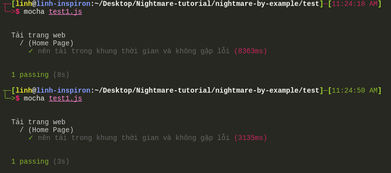
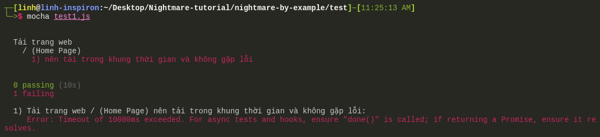
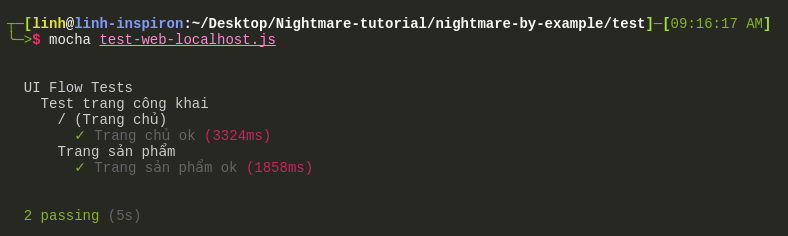
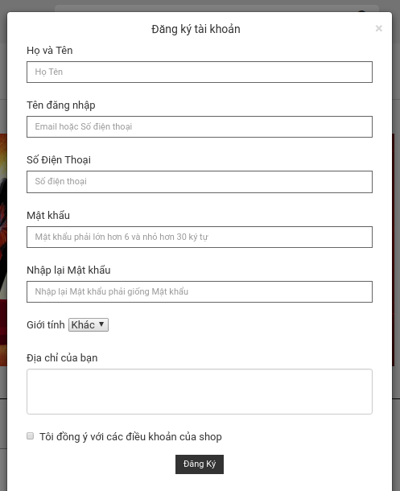
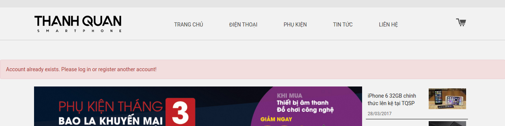
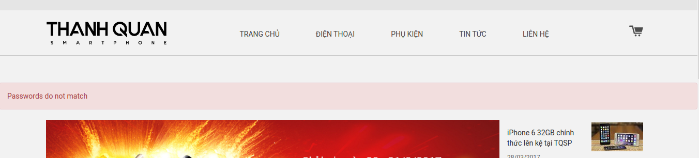
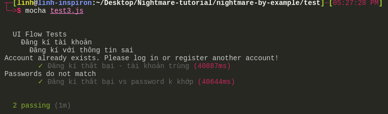
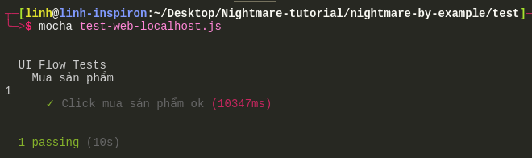
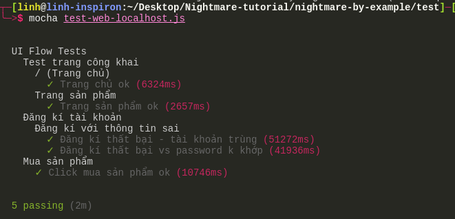

# Nightmarejs

* Nightmare là một thư viện tự động hóa chạy browser. Nightmare sử dụng electron để truy cập web, mỗi lần truy xuất vào 1 url và lấy dữ liệu trên trang này, sẽ dùng mở bằng electron, hoàn thành tác vụ thì ngắt và đóng electron  
* Nightmare bắt chước các tương tác của người dùng trên 1 trang web như:
  * Truy xuất: `goto`
  * Đánh chữ: `type` 
  * Nhấn chuột: `click`
* Thường được sử dụng cho kiểm thử UI hoặc cào dữ liệu

## Cài đặt: 
* Nightmare là module của Nodejs nên máy các bạn cần cài đặt Nodejs

* Cài đặt Nightmarejs với npm

```bash
$ npm install --save nightmare
```

* Các file nightmare chúng ta sẽ viết là javascript nên ví dụ để chạy 1 file cào dữ liệu từ vnexpress, tên file là vnexpress.js

```bash
$ node vnexpress.js
```

## THỰC HÀNH NIGHTMARE QUA TỪNG VÍ DỤ:
1. [Lấy Tiêu Đề Báo Trên Vnexpress](#ví-dụ-lấy-tiêu-đề-các-bài-báo-trên-trang-chủ-vnexpress)
2. [Lấy Tiêu Đề Báo Trên Kenh14 Với scrollTo](#ví-dụ-scrollto-trên-kenh14)
3. [Tự Động Đăng Nhập Và Tương Tác Trên Facebook](#ví-dụ-tự-động-đăng-nhập-vào-facebook)
4. [Xóa Cookies Trên Youtube](#ví-dụ-lấy-cookies-trên-youtube)
5. [Tìm Kiếm Ảnh Trên Google Và Tự Động Tải Về Máy](#tự-động-download-ảnh-tìm-kiếm-trên-google-về-máy)
6. [Cào Dử Liệu Sản Phẩm Trên 1 Trang Bán Hàng](#cào-dữ-liệu-sản-phẩm-trên-1-trang-bán-hàng)
7. [Lưu Vào Postgresql Dùng Pg-Promise](#lưu-sản-phẩm-vào-csdl-postgresql)
8. [Lưu Vào MongoDB Dùng Mongoose](#lưu-sản-phẩm-vào-csdl-mongodb)
9. [Tải Nhạc Tự Động Trên Chiasenhac](#tải-nhạc-tự-động-trên-chiasenhac)
9. [UI Testing - Kiểm Thử Giao Diện Trang Web](#ui-testing-với-nightmarejs)

## VÍ DỤ LẤY TIÊU ĐỀ CÁC BÀI BÁO TRÊN TRANG CHỦ VNEXPRESS
#### RUN:

```bash
$ cd 1_Vnexpress
$ node vnexpress.js
```

#### CÁC BƯỚC: 
* Gọi module và khởi tạo nightmare
```js
// Gọi module Nightmare để sử dụng
const Nightmare = require('nightmare');
// khởi tạo nightmare
const nightmare = Nightmare();
```

* `goto(url)`: truy xuất 1 trang web theo địa chị url truyền vào
  * Có thể đặt thời gian thoát - ném ra lỗi trong qua trình chạy chương trình (throw an exception - exception là lỗi xảy ra trong runtime) nếu `goto()` không hoàn thành loading trong khoảng thời gian nhất định với `gotoTimeout`. Lưu ý, chỉ ném lỗi khi hết thời gian mà DOM chưa đc tải (chứ không phải là tất cả các resources trên trang web)
```js
  // thêm option lúc khởi tạo nightmare
  const nightmare = Nightmare({
    gotoTimeout: 1000 // tính theo ms -> 1000ms là 1s
  })
```
  * `{show: true}` option để hiển thị electron web khi chạy chương trình nightmare
```js
  // thêm option lúc khởi tạo nightmare
  const nightmare = Nightmare({
    gotoTimeout: 1000,
    show: true // hiển thị web khi chạy, nếu không có option này thì chạy ẩn
  })
  // sau khi khởi tạo -> truy xuất vào trang vnexpress.net
  nightmare.goto('http://vnexpress.net/') 
```

* `evaluate(function(){...})` dùng để lấy thông tin từ 1 website. Thực hiện hàm bên trong evaluate() trên trang web đang truy cập để lấy thông tin sau đó trả về dữ liệu đc return từ hàm đó

```js
  nightmare.goto('http://vnexpress.net/')
  .evaluate(function () {
    // news là 1 mảng chứa các thẻ <a> nằm trong <div> có class 'title_news'
    let news = document.querySelectorAll('.title_news a');
    // khai báo 1 mảng rỗng để chứa các tiêu đề
    let titles = [];
    // chạy qua mảng này và lấy tiêu đề
    news.forEach((article) => { // article ở đây là mỗi phần tử trong mảng news
      titles.push(article.innerText.trim()); // lần lượt đẩy các tiêu đề vào mảng titles
    })
    return titles; // kết thúc hàm trả về mảng titles
  })
```

* **Lưu ý**: 
  * `document.querySelectorAll('.title_news a')` sẽ tìm tất cả các `<a>` là con của thẻ có class `.title_news`
  * `trim()` cắt các khoảng trống trắng trước và sau 1 chuỗi

  ```js
  let title = '\n     Đây là 1 tiêu đề    ';
  console.log(title);
  let trimmedTitle = title.trim()
  console.log(trimmedTitle); // 'Đây là 1 tiêu đề'
  ```

* `end()` kết thúc 1 quy trình trên 1 website, ngắt kết nối và đống cửa sổ electron
* Nếu sử dụng promise `then()` phải đc gọi sau khi `end()`. Trong `then()`, ta có thể hứng kết quả trả về từ đoạn lấy dữ liệu trang web trong `evaluate()`

```js
  .end() // kết thúc quy trình trên electron -> đóng electron
  .then(function (titles) { // titles trong then() này chính là kết quả titles đc trả về ở trên
    console.log(titles);
    console.log('Số lượng bài viết: ', titles.length);
  })
  .catch(error => { // xử lý trong trường hợp gặp lỗi 
    console.log('ERROR: ', error);
  })
```

## VÍ DỤ scrollTo TRÊN KENH14
* Vào mục du lịch của trang kenh14.vn, scroll xuống để xem load hết các bài trong trang đó vì kenh14 có chức năng lazy loading (chỉ tải dữ liệu khi cần thiết, khi kéo xuống đến đó, không load tất cả dữ liệu ngay lần đầu render trang)

```bash
$ node kenh14.js
```

## VÍ DỤ TỰ ĐỘNG ĐĂNG NHẬP VÀO FACEBOOK
#### CHẠY:

```bash
$ cd 2_Kenh14-Scroll/
$ node fb.js // đăng nhập fb sử dụng type() và click()
$ node fb2.js // sử dụng insert() và type()
```

#### ĐĂNG NHẬP
* `type(selector, text)` sẽ tự động điền chuỗi `text` vào `selector`. Nếu `text` trống thì sẽ xóa giá trị trong `selector`
* Có thể gọi sự kiện keypress với `type` sử dụng unicode thay cho keypress, ví dụ, muốn thực hiện sự kiện nhấn phím 'enter' `.type('body', '\u000d')` (ở đây, selector chính là thẻ <body>, '\u000d' sẽ thay cho nút 'enter')

* `insert(selector, text)` tương tự như `type` nhưng không có chức nặng gọi sự kiện liên quan đến keyboard => nếu chỉ điền chữ thì dùng `insert` sẽ nhanh hơn 

#### VÀO 1 GROUP VÀ ĐẾM SỐ BÀI VIẾT THEO NGƯỜI ĐĂNG

```bash
$ cd 2_Kenh14-Scroll/
$ node fb3.js 
```

## VÍ DỤ LẤY COOKIES TRÊN YOUTUBE
#### CHẠY:

```bash
$ cd 4_Youtube-Cookies/
$ node youtube.js
```

* `cookies.get({})` lấy tất cả cookies tại url hiện tại. Ví dụ ta vào trang youtube.com thì `cookies.get()` sẽ tìm và lấy cookies của url 'https://www.youtube.com/' 
* `cookies.get({url: null})` lấy tất cả cookies của tất cả các url có trong phần cookies. Ví dụ trang youtube.com trong phần cookies thực ra có 2 urls: 'https://www.youtube.com/' và 1 đg dẫn quảng cáo

## TỰ ĐỘNG DOWNLOAD ẢNH TÌM KIẾM TRÊN GOOGLE VỀ MÁY 
#### CHẠY:

```bash
$ cd 5_Google-Images/
$ node google-img-full.js
```

#### CÁC BƯỚC :
  1. Truy xuất vào google
  2. Đánh tìm kiếm: 'Ảnh top 10 bãi biển đẹp nhất Việt Nam'
  3. Nhấn vào đường dẫn 'Hình ảnh khác...' để chuyển sang phần tìm kiếm ảnh `g-more-link a`
  4. Click vào từng ảnh và lấy đường dẫn của các ảnh
  5. Lưu những đường dẫn này vào 1 mảng rồi khởi tạo nightmare lần lượt vào từng đường dẫn ảnh và tải về
  6. Sử dụng modules `fs`, `shelljs` và `image-downloader` để tải và lưu ảnh vào máy 

* Link documentations:
  * [fs](https://nodejs.org/api/fs.html)
  * [shelljs](https://github.com/shelljs/shelljs)
  * [image-downloader](https://github.com/demsking/image-downloader)
* Cần cài đặt từ npm, fs là native modules của nodejs nên không cần cài đặt từ npm

```bash
$ npm install --save image-downloader
$ npm install --save shelljs
```

#### Nightmare lấy các đường dẫn ảnh:

#### Download ảnh xuống máy: có 2 dạng là ảnh có đường dẫn url tuyệt đối `https://...` và ảnh đc encoded base64 `data:image...`
* Với ảnh có url hoàn chỉnh, ta có thể sử dụng module `image-downloader` để tải và lưu về máy
```js
// dưới đây sẽ là đoạn code để tải ảnh có đg dẫn url hoàn chỉnh
        let options = {
          url: img, // img chính là url hoàn chỉnh
          dest: destPath + '/' + index + '.jpg'
        }
        // gọi module image-downloader để tải về máy
        imageDownloader
          .image(options)
          .then(({filename, image}) => {
            console.log('File saved ok', filename)
          })
          .catch((err) => {
            throw err
          });
```

* Tuy nhiên nếu ảnh đc encoded base64, đường dẫn của ảnh sẽ theo dạng 'data:image/jpeg;base64/9j/4AAQSk....', với ảnh kiểu này module image-downloader không tải được ảnh. 

```js
// đoạn code để lưu ảnh encoded base64 vào máy
        // tìm và thay các phần k cần thiết với ''
        let data = img.replace(/^data:image\/\w+;base64,/, '')
        // dùng hàm fs.writeFile() tham số đầu tiên là vị trí lưu file, data là dữ liệu của ảnh ecoded base64 
        fs.writeFile(`${destPath}/_${index}.jpg`, data, {
          encoding: 'base64'
        }, (error) => {
          if (error) 
            throw error;
          console.log('File saved ok');
        })
```

## CÀO DỮ LIỆU SẢN PHẨM TRÊN 1 TRANG BÁN HÀNG 
#### CHẠY:

```bash
$ cd 6_Save-To-Json/
$ node crawl-to-json.js
```
#### CÁC BƯỚC:
1. Vào phần sản phẩm của 1 trang web
2. Lấy url của tất cả sản phẩm trong 1 trang (không chuyển trang)
3. Chạy qua từng url với nightmare và lấy thông tin sản phẩm
4. Lưu mảng thông tin sản phẩm vào file json

* Sử dụng thêm module `async` để quản lý và giới hạn chỉ chạy 2 tiến trình nightmare (mở 2 cửa sổ electron) 1 lúc

```bash
// cần cài async
$ npm install --save async
```

## LƯU SẢN PHẨM VÀO CSDL POSTGRESQL
#### CHẠY:

```bash
$ cd 7_Save-To-Postgresql/
$ node crawl-to-postgres.js
```
#### CÁC BƯỚC:
1. Phần cào dữ liệu sản phầm tương tự phần ở trên
2. Nhưng thay vì save vào file json, sẽ kết nối và lưu trực tiếp vào CSDL Postgresql qua `pg-promise`

#### CÀI VÀ KẾT NỐI POSTGRES

```bash
npm install --save pg-promise
```
* Tạo 1 file `pgp.js` để khởi tạo kết nối với CSDL Postgres trong máy
```js
// cấu hình kết nối với postgres
const cn = {
  host: 'localhost',
  port: 5432,
  database: 'test_product',
  user: 'postgres',
  password: 'abc'
};

const pgp = require('pg-promise')();

module.exports.db = pgp(cn);
```
  * Trong database 'test_product' cần có 1 table tên là 'product' để chứa các thông tin sản phẩm đc cào về
  * Mở postgresql với pgAdmin hoặc psql hay pgcli để chạy SQL tạo bảng 
  * Những câu lệnh dưới đây là nếu bạn muốn dùng terminal để tương tác với Postgres (psql hay pgcli)
  ```bash
  // nếu sử dụng pgcli thì cần mở terminal và kết nối với postgres trong máy mình chạy ở cổng 5432
  pgcli -h localhost -p 5432 -U postgres -W  // kết nối vào tài khoản mặc định postgres
  // hoặc nếu đã có CSDL thì kết nối thẳng với CSDL đó
  pgcli -h localhost -p 5432 -U postgres -W -d test_product
  ```
  ```sql
  // tạo database
  CREATE DATABASE test_product;
  // khi đã bên trong database 'test_product' thì tạo bảng 'product' 
  CREATE TABLE product (id SERIAL PRIMARY KEY, product_name TEXT, manufacturer TEXT, price INTEGER, main_property JSON)
  ```
* Trong file crawl chính `crawl-to-postgres.js`:
```js
// kết nối với CSDL
const {db,config} = require('./pgp.js');
const pgp = require('pg-promise');
```

* Thay hàm `exportJson()` ở phần trên, sử dụng trực tiếp lệnh insert vào CSDL

```js
// -----------Export to database directly---------
db
  .none('INSERT INTO product (product_name, manufacturer, price, main_property) VALUES( ${product_name}, ${manufacturer}, ${price}, ${main_property})', res)
  .then(() => {
    // thêm vào CSDL thành công;
    console.log("insert success");
  })
  .catch(error => {
    console.log(error.message);
  });
```

## LƯU SẢN PHẨM VÀO CSDL MONGODB
#### CHẠY:
```bash
$ cd 7_Save-To-MongoDB/
$ node crawl-to-mongo.js
```
#### CÁC BƯỚC:
1. Phần cào dữ liệu sản phầm tương tự phần ở trên
2. Nhưng thay vì save vào file json, sẽ kết nối và lưu trực tiếp vào CSDL MongoDB qua `mongoose`
* Lưu ý các bạn cần cài đặt mongoDB trên máy. Tham khảo trang chủ của mongoDB để [cài đặt mongo](https://docs.mongodb.com/getting-started/shell/installation/)

#### CÀI VÀ KẾT NỐI MONGODB

```bash
npm install --save mongoose
```

* Tạo 1 file `mongoose.js` để khởi tạo kết nối với CSDL Postgres trong máy

```js
const mongoose = require('mongoose');
// Kết nối với mongodb, database là 'test_product'
// Nếu connect tới 1 database chưa tồn tại, Mongo sẽ tự động tạo ra db đấy
mongoose.connect('mongodb://localhost/test_product')
// lắng nghe sự kiện (connection event) xem khi nào kết nối đc vs mongo
// 'once' - chỉ lắng nghe sự kiện 'open' này 1 lần duy nhất
mongoose.connection.once('open', function () {
  console.log('Connection success !!!');
}).on('error', function (error) {
  console.log('Connection error: ', error);
});

// Tạo 1 Schema - mỗi 1 schema sẽ tương ứng với 1 MongoDB collection
// Schema này giúp định nghĩa trước cấu trúc của các đối tượng (documents) trong 1 collection
const productSchema = new mongoose.Schema({
  product_name: String,
  manufacturer: String,
  price: Number,
  main_property: Object,
})
// Tạo 1 model sản phẩm để chúng ta sử dụng
const Product = mongoose.model('Product', productSchema);

module.exports = Product;
```

* Trong file crawl chính `crawl-to-mongo.js`: phần cào dữ liệu hoàn toàn giống ở các ví dụ crawl-to-postgres hay crawl-to-json. Chúng ta chỉ cần thay đổi phần lưu dữ liệu
* Gọi mongo model mà chúng ta định nghĩa ở bên `mongoose.js`

```js
// kết nối với CSDL MongoDB
const mongoose = require('mongoose');
const Product = require('./mongoose.js');
```

* Thay phần export vào Postgrest ở ví dụ trước bằng Mongo, 

```js
          // -----------Export to database directly---------
          let newProduct = new Product(res)
            .save()
            .then(function (newProduct) {
              console.log(newProduct);
              console.log('Insert to Mongo success');
              cb(null, res);
            })
            .catch(error => {
              console.log(error.message);
            })
```

* **Lưu ý:** Với Mongoose, sau khi hoàn thành việc lưu sản phẩm vào collection `products` trong database `test_product`, kết nối với CSDL k tự động ngưng nên chương trình của chúng ta vẫn chạy chứ không tự động tắt
  * Cần phải chạy câu lệnh ngắt kết nối `mongoose.connection.close` sau khi hoàn thành lưu tất cả dữ liệu cào đc

  ```js
      console.log('Hoàn thành chạy crawl()');
      // Ngắt kết nối của mongoose với CSDL
      mongoose.connection.close(function () { 
        console.log('Mongoose connection ends !!');  
      }); 
  ```

## TẢI NHẠC TỰ ĐỘNG TRÊN CHIASENHAC
#### CHẠY:

```bash
$ cd 9_download-Music/
$ node download-music.js
```

#### CÁC BƯỚC:
* Tương tự với tải sản phẩm phần trên
* Chạy 1 tiến trình để lấy hết các link vào từng bài hát
* Sử dụng hàm `crawl()` chạy qua từng link bài hát, mỗi lần lại gọi hàm `crawlEachUrl()` tạo 1 tiến trình nightmare con để lấy đường dẫn tải nhạc và tải về máy
* Để tải nhạc ta sẽ sử dụng module `request` để đọc nội dung trả về (response) khi gửi get request lên url tải nhạc và ghi nó thành file nhạc trong máy

```js
// sử dụng module request để tải file nhạc 
request
  .get('đường dẫn tải nhạc') // lấy dữ liệu stream trả về từ request lên 'đường dẫn tải nahcj'
  .on('error', function (err) {
  // handle error
    if (err)
      throw err;
  })
  .pipe(fs.createWriteStream('tên-bài-hát.mp3')); // sau đó ghi dữ liệu vào write stream 
```


## UI TESTING VỚI NIGHTMAREJS
* Sử dụng Nightmare để kiểm thử UI - UI Testing. Nightmare mô phỏng lại các hành vi của người dùng như vào 1 trang web, điền ô đăng nhập hay tìm kiếm, click vào các nút hay đường links
* Dưới đây sẽ hướng dẫn sử dụng Nightmarejs và Mocha để đánh giá UI của 1 trang web
* [Mocha](https://mochajs.org/ "Mocha"): là 1 test framework phổ biến cho Nodejs, tham khảo thêm tại đường dẫn
* Mocha là 1 testing framework cho phép dựng nên các test case, sẽ đc dùng với 1 thư viện assertion để kiểm tra kết quả trả về của test case và kết quả chúng ta mong đợi
* Trong những ví dụ dưới đây, tôi sẽ sử dụng module 'assert' có sẵn của Nodejs. Ngoài ra, các bạn có thể tham khảo và sử dụng các thư viện khác như chai, expect.js, should.js,....

### Để chạy các file test này

```bash
npm test // chạy tất cả các file test trong folder test
// chạy từng file test
cd test // mở terminal trong folder test
mocha test1.js // chạy test1.js
```

### Ví dụ 1: kiểm thử tốc độ tải trang vnexpress.net

* Tạo test/test.js

```bash
mkdir test
// cài mocha và nightmare khi chỉ dùng để test
npm install --save-dev mocha
npm install --save-dev nightmare
```

* Viết các file test trong folder test/

```bash
cd test
touch test1.js
```

* Gọi các modules cần sử dụng

```js
const Nightmare = require('nightmare')
const assert = require('assert') // 1 assertion library có sẵn trong Nodejs
```

* Khai báo 1 bộ test

```js
describe('Tải trang web',  function () {
  // viết các bộ test nhỏ hay các test case trong này
  //..........
})
```

* Sử dụng hàm `timeout()` của Mocha. Chi tiết về hàm này cách giá trị 'this' đc gán trong Mocha xem ví dụ trong file 
`test2.js`
**Sẽ sử dụng hoàn toàn hàm vô danh (anonymous function) thay vì arrow function**

```js
describe('Tải trang web',  function () {
  // Gợi ý: đặt timeout khi trang web chạy trên local 5s, trên remote web server 10s
  this.timeout('10s')
})
```

* Khởi tạo Nightmare để sử dụng trong bộ test

```js
describe('Tải trang web',  function () {
  // Gợi ý: đặt timeout khi trang web chạy trên local 5s, trên remote web server 10s
  this.timeout('10s')

  // khai báo biến nightmare và gán giá trị null - 1 giá trị rỗng
  // làm 1 biến để ta khởi tạo nightmare
  let nightmare = null;
  // vì mỗi bộ test con bên trong lại cần sử dụng 1 tiến trình nightmare riêng
  // beforeEach() chính là 1 hook trong Mocha -> đc gọi trc khi chạy mỗi bộ test con
  beforeEach('khởi tạo nightmare', function () {
    nightmare = new Nightmare({show: true}) // khởi tạo 1 nightmare riêng cho từng bộ test con
  })
})
```

* Khai báo 1 bộ test con: test con tải trang chủ
* Test case 'tải trang chủ': truy xuất vào 'https://vnexpress.net' -> tải xong trang chủ -> kết thúc tiến trình electron -> gọi hàm callback done() -> báo lại với Mocha là test case hoàn thành -> in kết quả trên terminal

```js
  describe('/ (Trang chủ)', function () {
    // mỗi it() là 1 test case
    it('nên tải trong khung thời gian và không gặp lỗi', function(done) {
      // nếu muốn kiểm tra 1 trang local  `http://localhost:port/path`
      nightmare.goto('https://vnexpress.net')
        .end()
        .then(function (result) {
          done()
        })
        .catch(done)
    })
  })
```

* Kết quả chạy `test1.js`



* Nếu ta thay 'vnexpress.net' bằng 1 trang web bị chặn như 'bbc.com', thì trang sẽ k load đc và quá 10s sẽ báo lỗi: 'Error: Timeout of 10000ms exceeded.' quá thời gian 10s -> timeout dừng test



* Tương tự với test tải trang chủ, ta có thể test tải các đg dẫn khác trong 1 trang web, ví dụ, trang sản phẩm, trang tin tức, trang đăng nhập,... Ví dụ với test vnexpress ở trên, thêm 1 test kiểm tra trang giải trí

```js
  describe('Trang tin giải trí', function () {
    it('nên tải trang tin tức ok', function (done) {
      nightmare
        .goto('http://giaitri.vnexpress.net/')
        .end()
        .then(function () {
          done()
        })
        .catch(done)
    })
  })
```

* Kết quả chạy `mocha test1.js` lúc này với 2 test nhỏ trong bộ test 'Tải trang web'

")

### Ví dụ 2: Kiểm thử 1 trang web đang phát triển, chạy trên localhost
* Các mục kiểm tra:
  * Tải trang ok
  * Scroll trang hiển thị giao diện ok
  * Đăng nhập, đăng kí ok
  * Xem sản phẩm + giỏ hàng ok
  * Quá trình thanh toán ok

* Kiểm thử 1 trang web bán hàng thử nghiệm chạy trên `http://localhost:3002/` 

```bash
mocha test-web-localhost.js
```

#### Test tải trang chủ và trang sản phẩm

```js 
// tạo bộ test UI
const Nightmare = require('nightmare')
const assert = require('assert')

describe('UI Flow Tests', function () {
  // bên trong này sẽ có nhiều test con kiểm tra tải trang, đăng kí, mua sản phẩm,...

  // khai báo và khởi tạo nightmare trước khi chạy mỗi test
  let nightmare = null
  beforeEach('khởi tạo nightmare', function () {
    nightmare = new Nightmare({show: true})
  })
  
```

* Bộ test con 'Test trang công khai' có 2 test con tải trang chủ và trang sản phẩm

```js
  describe('Test trang công khai', function () {
    describe('/ (Trang chủ)', function () {
      // set thời gian tải trang chủ không quá 5s
      this.timeout('s')

      it('Trang chủ ok', function (done) {
        nightmare
          .goto('http://localhost:3002/')
          .end()
          .then(function (result) {
            done()
          })
          .catch(done)
      })
    })

    describe('Trang sản phẩm', function () {
      this.timeout('s')
      it('Trang sản phẩm ok', function (done) {
        nightmare
          .goto('http://localhost:3002/dien-thoai')
          .scrollTo(500, 0)
          .wait(2000)
          .end()
          .then(result => {
            done()
          })
          .catch(done)
      })
    })
  })
```

* Chạy test `mocha test-web-localhost.js` trả về kết quả: thời gian tải cả 2 trang dưới 5s



#### Bộ test con 'Đăng kí tài khoản': 

* Bên trong bộ test con này, ta có thể viết các test con kiểm tra. **Khi test ta nên kiểm tra cả trường hợp thành công (test passed) lẫn thất bại (test failed)**. Ví dụ:
  * Đăng kí tài khoản với thông tin sai: 
    1. Tài khoản trùng, đã tồn tại trong cơ sở dữ liệu rồi
    2. Thông tin đăng kí đầu vào không hợp lệ: password không khớp
  * Đăng kí tài khoản với thông tin hợp lệ

* Ô đăng kí tài khoản của trang Thanhquanmobile như dưới đây



#### *Trường hợp 1: đăng kí với thông tin trùng với tài khoản đã tồn tại*
* Trong cơ sở dữ liệu của trang web, đã có 1 tài khoản tồn tại với email là **fake3@gmail.com** nên nếu đăng kí email này sẽ báo lỗi -> server sẽ chuyển ta về trang chủ với 1 thông báo lỗi như thế này



* Khi test đăng kí tài khoản, lúc đầu lần lượt thêm thông tin vào các ô input đăng kí tài khoàn như dưới đây thì gặp lỗi: ô email và ô password đầu tiên không điền dữ liệu vào đc
```js
 describe('Đăng kí tài khoản', function () {
    describe('Đăng kí với thông tin sai', function () {
      it('Đăng kí thất bại - tài khoản trùng', function (done) {
        nightmare
          .goto('http://localhost:3002/')
          .wait(3000)
          .click('#login')
          .click("span[data-target='#registerModal']")
          .wait(3000)
          .insert("input[name='fullname']", 'Test Name 1')
          .wait(3000)
          .type("input[name='email']", 'fake3@gmail.com')  
          .wait(3000)
          .insert("input[name='phone']", '0912345678')
          .wait(3000)
          .insert("input[name='password2']", 'fakepassword3')
          .wait(3000)
          .type("input[name='password']", 'fakepassword3')
          .wait(3000)
          .select("select[name='gender']", 'Nữ') // cho phép chọn giá trị của dropdown element
          .wait(1000)
          .insert("textarea[name='address']", 'fake address')
          .wait(1000)
          .check("input[name='agreement']") // chọn checkbox
          .wait(1000)
          .click('#signup-submit')
          .wait(5000)
          // sau khi đăng kí -> đăng kí thất bại sẽ trở về trang chủ vs alert báo lỗi
          // lấy alert báo lỗi để so sánh xem là lỗi gì
          .evaluate(function () {
            // .......
          })
      })
    })
```

* Sửa: 2 ô bị lỗi phải đc click vào trc (phần tử html đấy phải đc 'focus') thì mới điền dữ liệu đc nên sau khi điền các ô kia rồi, click submit form -> vì thiếu thông tin ô email -> ô html đc focus -> type() dữ liệu vào đây
* Sau đó tiếp tục submit form -> vì thiếu thông tin ô password nên -> ô html của password đc focus -> type() dữ liệu vào đây
* Bây giờ tất cả các ô input đã đc điền đầy đủ -> click submit form và chờ server xử lý request

```js
  describe('Đăng kí tài khoản', function () {
    describe('Đăng kí với thông tin sai', function () {
      it('Đăng kí thất bại - tài khoản trùng', function (done) {
        nightmare
          .goto('http://localhost:3002/')
          .wait(3000)
          .click('#login')
          .click("span[data-target='#registerModal']")
          .wait(3000)
          .insert("input[name='fullname']", 'Test Name 1')
          .wait(3000)
          .insert("input[name='phone']", '0912345678')
          .wait(3000)
          .insert("input[name='password2']", 'fakepassword3')
          .wait(3000)
          .select("select[name='gender']", 'Nữ')
          .wait(1000)
          .insert("textarea[name='address']", 'fake address')
          .wait(1000)
          .check("input[name='agreement']")
          .wait(1000)
          .click('#signup-submit')
          .wait(5000)
          .type("input[name='email']", 'fake3@gmail.com')
          .wait(3000)
          .click('#signup-submit')
          .type("input[name='password']", 'fakepassword3')
          .wait(3000)
          .click('#signup-submit')
          .wait(5000)
          // sau khi đăng kí -> đăng kí thất bại sẽ trở về trang chủ vs alert báo lỗi
          // lấy alert báo lỗi để so sánh xem là lỗi gì
          .evaluate(function () {
            let alert = document
              .querySelector('.alert.alert-danger')
              .innerText;
            return alert;
          })
          .end()
          .then(function (alert) {
            console.log(alert);
            // trang web báo lại alert tùy theo lỗi
            if (alert === 'Account already exists. Please log in or register another account!') {
              done()
            }
          })
          .catch(function (error) {
            console.log(error);
          })
      })
      // Phần sau sẽ thêm test case trường hợp 2, password k khớp dưới đây
      //.......
    })
  })
```

* Nên sau khi lấy đc chuỗi alert trong phần `evaluate()`, trong phần `then()` ta sẽ so sánh giá trị này với chuỗi thực tế mà trang web trả về. Nếu giống nhau -> gọi hàm callback `done()` để hoàn thành test

#### *Trường hợp 2: form đăng kí có password không khớp*
* Server sẽ xem xét form đăng kí, nếu password k khớp -> chuyển về trang chủ và hiển thị alert báo lỗi



* Sau test case của trường hợp 1 ở trên, viết test case cho trường hợp 2 tương tự 
  * Notes: nhớ lỗi document.querySelector('.alert.alert-danger') vs ('.alert .alert-danger')

```js
// thêm vào sau test case trường hợp 1 ở trên
      it('Đăng kí thất bại vs password k khớp', function (done) {
        nightmare
          .goto('http://localhost:3002/')
          .wait(3000)
          .click('#login')
          .click("span[data-target='#registerModal']")
          .wait(3000)
          .insert("input[name='fullname']", 'Test Name 4')
          .wait(3000)
          .insert("input[name='phone']", '0912345678')
          .wait(3000)
          .insert("input[name='password2']", 'fakepassword4')
          .wait(3000)
          .select("select[name='gender']", 'Nữ')
          .wait(1000)
          .insert("textarea[name='address']", 'fake address')
          .wait(1000)
          .check("input[name='agreement']")
          .wait(1000)
          .click('#signup-submit')
          .wait(5000)
          .type("input[name='email']", 'fake4@gmail.com')
          .wait(3000)
          .click('#signup-submit')
          .type("input[name='password']", 'fakepassword3')
          .wait(3000)
          .click('#signup-submit')
          .wait(5000)
          .evaluate(function () {
            let alert = document.querySelector('.alert.alert-danger')
              .innerText;
            return alert;
          })
          .end()
          .then(function (alert) {
            console.log(alert); 
            // trang web báo lại alert tùy theo lỗi
            if (alert === 'Passwords do not match') {
              done()
            }
          })
          .catch(function (error) {
            console.log(error);
          })
      })
```

* Tương tự trường hợp 1, ta cũng lấy chuỗi alert và so sánh rồi gọi callback `done()` để kết thúc test case
* Nếu chạy cả 2 test case trên, kết quả trên terminal sẽ như sau.



#### Test chức năng click mua hàng -> Số lượng sản phẩm trên icon giỏ hàng đc cập nhật

* Test 'Mua sản phẩm'. Ở trang sản phẩm, nếu hover vào 1 ô sản phẩm sẽ có nút mua hàng. Nút mua hàng của mỗi sản phẩm có thuộc tính htmt `id="buy_productId"` -> click vào đây sẽ thêm sản phẩm có `productId` như trong thuộc tính id vào giỏ hàng -> icon màu đỏ hiển thị số sản phẩm trong giỏ hàng sẽ đc cập nhật

```js
  describe('Mua sản phẩm', function () {
    it('Click mua sản phẩm ok', function (done) {
      nightmare.goto('http://localhost:3002/dien-thoai')
        .wait(3000)
        .click('#buy_rJBsc-wRe a') // click mua sản phẩm có id là 'rJBsc-wRe'
        .wait(5000)
        .evaluate(function () {
          let productNumber = document.querySelector('.my-cart-badge') // số lượng sản phẩm hiển thị trên icon giỏ hàng
            .innerText;
          return productNumber;
        })
        .end()
        .then(productNumber => {
          console.log(productNumber);
          if (productNumber == '1') { // thêm 1 sản phẩm nên số lượng phải bằng 1
            done()
          }
        })
        .catch(done)
    })
  })
``` 

* Nếu sản phẩm đc thêm vào giỏ hàng thành công -> số trên giỏ hàng icon tăng lên từ 0 thành 1 -> trong `evaluate()` lấy giá trị số lượng sản phẩm `productNumber` rồi so sánh -> nếu bằng 1 thì -> gọi `done()` kết thúc test



#### Chạy 1 lượt tất cả các test trong 'UI Flow Tests'
* Comment lại các dòng console.log trong `then()`



## TẠO DỮ LIỆU GIẢ BẰNG [Mockaroo](https://www.mockaroo.com)


* Trang Mockaroo cho phép tạo dữ liệu giả, có thể thêm số cột hay trường, chọn kiểu dữ liệu, chọn số % dữ liệu trống với giá trị null
* Có thể download dữ liệu về dạng csv, json, sql,...
* Chúng ta sẽ thử tạo 100 bản dữ liệu với 

* To be updated...